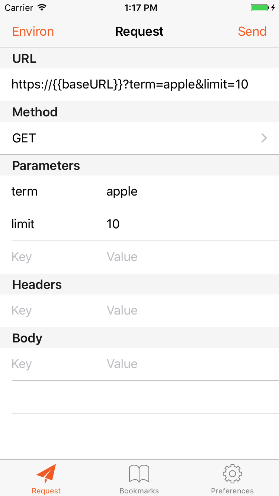
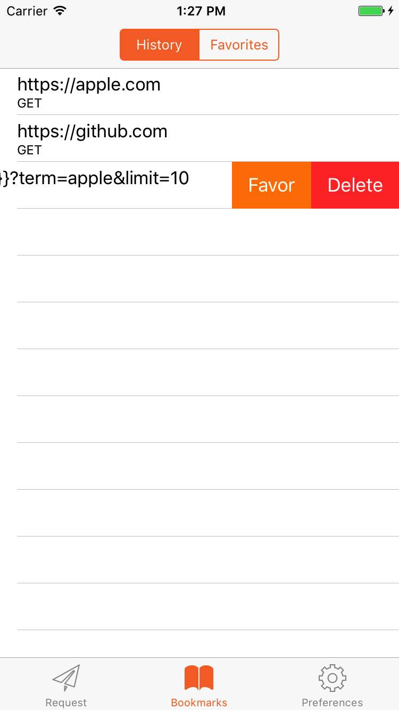
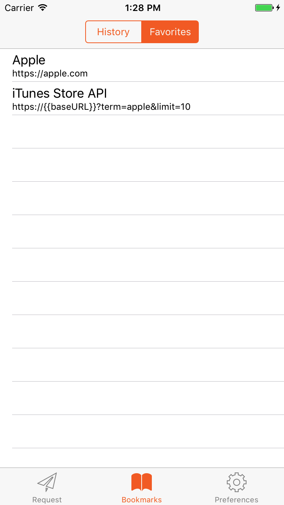
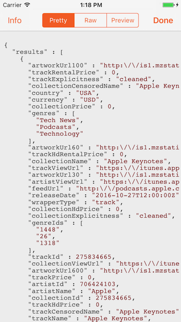
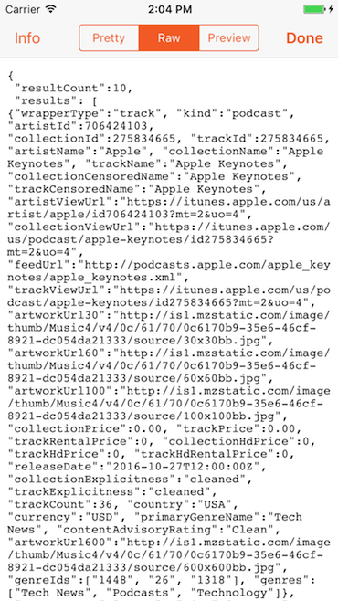
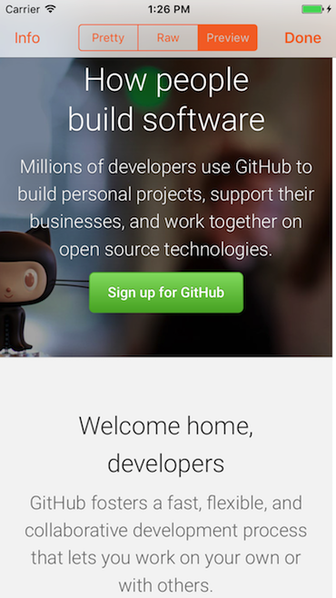
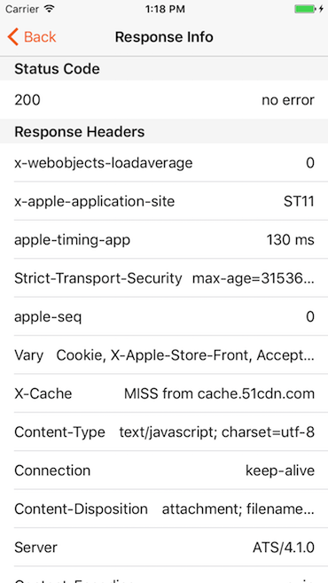

# PocketHTTP

A lightweight iOS app to let you test your HTTP APIs easily on the go, somewhat like a mobile version of [Postman](https://www.getpostman.com).

## Features

* **Fully customized HTTP request**

* **Request bookmarks**

* **Environment variables**

* **Comprehensive response viewing**

## Installing

1. Clone the content of **PocketHTTP**
1. Open **PocketHTTP.xcworkspace** in Xcode
1. Open Xcode's **Preferences > Accounts** and add your Apple ID
1. In Xcode's sidebar select **PocketHTTP** and go to **Targets > PocketHTTP > General > Identity** and add a word to the end of the **Bundle Identifier** to make it unique, also select your Apple ID in **Signing > Team**
1. Connect your iPhone or iPad and select it in Xcode's **Product menu > Destination**
1. Press **CMD+R** or **Product > Run** to install PocketHTTP
1. If you install using a free (non-developer) account, make sure to rebuild PocketHTTP every 7 days, otherwise it will quit at launch when your certificate expires

## Open-source libraries used

* [Alamofire](https://github.com/Alamofire/Alamofire)
* [highlight.js](https://github.com/isagalaev/highlight.js)
